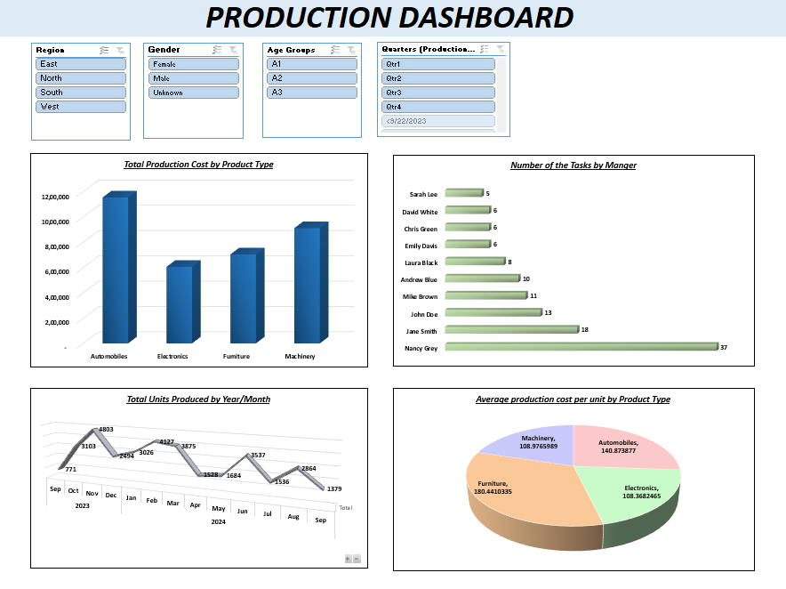

# Excel-Pivot-Dashboard-Practices

This repository demonstrates how Microsoft Excel can be used for advanced data analysis and visualization using pivot tables and dashboards. The project is based on a production dataset with 120 records, including product type, units produced, total cost, region, manager, gender, and age groups.

## 📊 Key Insights
- Automobiles recorded the highest total cost (1,152,805).
- Nancy Grey managed the maximum tasks (37).
- Production in 2024 (23,556 units) was more than double compared to 2023 (11,171).
- Furniture had the highest average production cost per unit (180.44).

## 📸 Dashboard Screenshot

## 📂 Files Included
- **Excel-Pivot-Dashboard-Practices.xlsx** → Dataset with production records, pivot tables, and dashboard.
- **Excel-Pivot-Dashboard-Practices.png** → Screenshot of the production dashboard for quick visualization.

## 🚀 Purpose
This project highlights the power of Excel in:
- Handling structured datasets  
- Performing pivot table analysis  
- Creating dashboards for clear business reporting  

Future enhancements may include integration with Power BI for interactive dashboards and automated reporting workflows.

---

## 🛠️ How to Use
1. Download the file **Excel-Pivot-Dashboard-Practices.xlsx** from this repository.  
2. Open it in Microsoft Excel (2016 or later recommended).  
3. Navigate to the **Dashboard sheet** to view consolidated charts and insights.  
4. Explore other sheets to check raw data and pivot tables.  
5. Modify filters or slicers to generate custom insights.  

---

## 👨‍💻 Author
**Hrishabh Bhadoriya**  
Final-year Computer Science Engineering Student | Data Analytics Enthusiast  
- 📍 Gwalior, India  
- 📧 Email: rishabbhadoriya@gmail.com  
- 🌐 LinkedIn: [Connect with me](https//www.linkedin.com/in/hrishabh-bhadoriya-6487bb2ba)  

